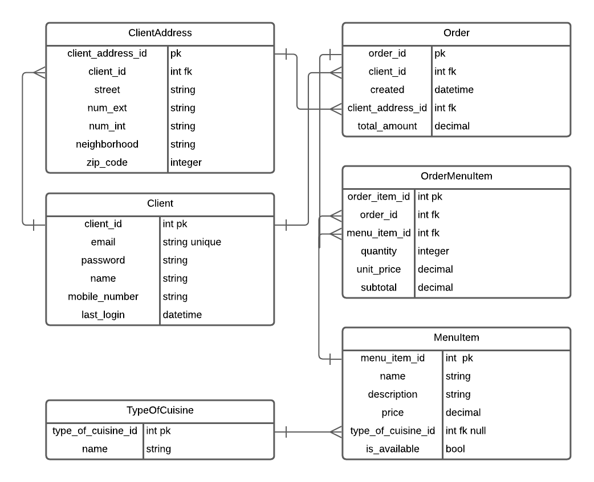
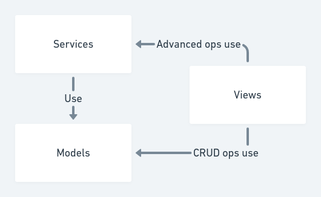

# My Dinner Code Challenge

This project is based on [The Simplest Docker + Django Example](https://github.com/cyface/simplest-docker-django-example)

## Requiriments

My Dinner is a famous restaurant to go to dinner and due to the high demand they have had, they decided to offer some of their dishes at home through an app. For now they will only offer their most requested dishes from 3 types of cuisine: Mexican, Italian and Japanese. After analyzing some of the existing apps on the market, they came to the conclusion of developing their own app since the existing proposals are left with a very high percentage of commission and it did not suit them. To develop the My Dinner app, it hired the company My Soft. For this project My Soft made two teams of developers, a front end team dedicated to developing the mobile app and another backend team in charge of developing the Rest API that will consume the app.
Suppose you are part of the backend team and as part of your first tasks you were assigned the following:

1. Model and build the first version of the Database to store for now the customer catalog, the catalog of dishes and the orders made by customers. As part of the task you will have to choose the type of DB that best suits you, which can be SQL or NoSQL or a combination of both.
    1. The minimum customer data are: email (Id), name, address (s) and telephone (you are free to add more if you consider it important).
    2. The minimum data for a dish are: dish id, name, description, price, type of cuisine (Mexican, Italian or Japanese) and status (Available, Not available).
    3. The minimum data for an order are: order id, customer, order date and time, customer address, total amount, and detail (list) of dishes considering the quantity, unit price, and subtotal for each dish.
2. Develop an application with the framework of your choice to implement the REST services listed below.
    1. Services to create and update.
    2. Service to request an order, considering the following validations:
        1. Must contain at least 2 saucers.
        2. The service hours for the app are from 4:00 p.m. to 9:00 p.m.
    3. Service to consult the number of dishes sold by type of cuisine that are within a range of dates passed as parameters.

## Commands

### Run the project:
- `make up` This will be build, run the docker container and open a bash from the
  container.

  Ctrl-D to stop

- `./dev up` One time you are in the container this command will run the django project.

  Ctrl-C to stop

- `./dev test` Run all the project tests.


## About building local environment with Linux systems

If you bring up the local environment in a linux system, maybe you can get some problems about users permissions when working with Docker.
So we give you a little procedure to avoid problems with users permissions structure in Linux.:

1- Delete containers

```
# or docker rm -f $(docker ps -aq) if you don't use docker beyond the test
make down
```

2- Give permissions to your system users to use Docker

```
## Where ${USER} is your current user
sudo usermod -aG docker ${USER}
```

3- Confirm current user is in docker group

```
## If you don't see docker in the list, then you possibly need to log off and log in again in your computer.
id -nG
```

4-  Get the current user id

```
## Commonly your user id number is near to 1000
id -u
```

5- Replace user id in Dockerfiles by your current user id

Edit `Dockerfile` and replace 1000 by your user id.

6- Rebuild the local environment

```
make rebuild
make up
```

## How the project works?

### DB diagram



### Architecture



#### Services:

Services interacts with models and
handles business logic for the domain.
It depends on Models if it has to
communicate with a datastore and
Integrations if it has to talk to another
domain.

#### Models:

Models stores the representation of
data in a datastore. It depends on a
datastore being present.

#### Views:

Originally, Views publishes the service functionality
for other domains to consume. It
depends on Services so it can publish
functionality. But in this case for speed development
Views depends Models. I suggest to use Models directly
for CRUD operations and Services for advance operations.
Nora admin, user interface and the rest api are located here.

Architecture based on [Django domains](https://phalt.github.io/django-api-domains/).
Some concept names has been changed.

### Video docs

- [Parte 1](https://www.loom.com/share/4ad90f551c454e719551bd2758a1c3e7)
- [Parte 2](https://www.loom.com/share/b48cd3cce47a487da70cb525769249e2)
- [Parte 3](https://www.loom.com/share/1dd0074b4d454279905e87676c159d21)
- [Parte 4](https://www.loom.com/share/b7c7fa13f915419e87053547baf50d91)
- [Parte 5](https://www.loom.com/share/a02579c92ad349979146d3e95da2aab1)

## Improvements

- Use authentication to list users addresses.
- The column client_id in Order table can be removed due to normalization.

## Bibliography

- [Managing Complexity with Architecture Patterns in Python](https://klaviyo.tech/managing-complexity-with-architecture-patterns-in-python-626b895710ca)
- [Django domains](https://phalt.github.io/django-api-domains/)
