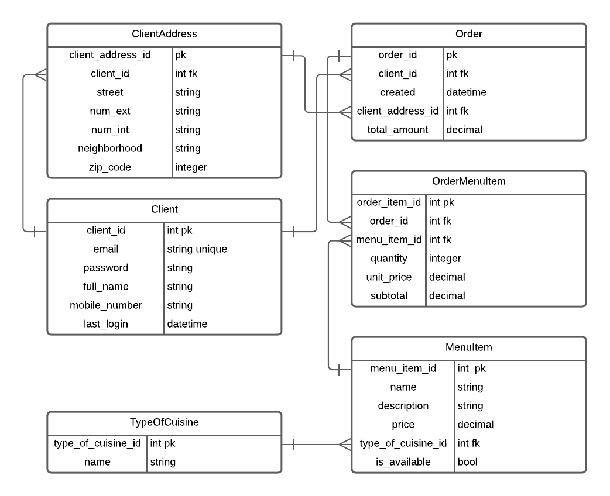

# My Dinner Backend

This project is based on [The Simplest Docker + Django Example](https://github.com/cyface/simplest-docker-django-example)

## Commands

### Run the project:
- `make up` This will be build, run the docker container and open a bash from the
  container.

  Ctrl-D to stop

- `./dev up` One time you are in the container this command will run the django project.

  Ctrl-C to stop

- `./dev test` Run all the project tests.


## About building local environment with Linux systems

If you bring up the local environment in a linux system, maybe you can get some problems about users permissions when working with Docker.
So we give you a little procedure to avoid problems with users permissions structure in Linux.:

1- Delete containers

```
# or docker rm -f $(docker ps -aq) if you don't use docker beyond the test
make down
```

2- Give permissions to your system users to use Docker

```
## Where ${USER} is your current user
sudo usermod -aG docker ${USER}
```

3- Confirm current user is in docker group

```
## If you don't see docker in the list, then you possibly need to log off and log in again in your computer.
id -nG
```

4-  Get the current user id

```
## Commonly your user id number is near to 1000
id -u
```

5- Replace user id in Dockerfiles by your current user id

Edit `Dockerfile` and replace 1000 by your user id.

6- Rebuild the local environment

```
make rebuild
make up
```

## How the project works?

### DB diagram



### Architecture


#### Services:

Services interacts with models and
handles business logic for the domain.
It depends on Models if it has to
communicate with a datastore and
Integrations if it has to talk to another
domain.

#### Models:

Models stores the representation of
data in a datastore. It depends on a
datastore being present.

#### Views:

Originally, Views publishes the service functionality
for other domains to consume. It
depends on Services so it can publish
functionality. But in this case for speed development
Views depends Models. I suggest to use Models directly
for CRUD operations and Services for advance operations.
Nora admin, user interface and the rest api are located here.

## Improvements

- Use authentication to list users addresses.
- The column client_id in Order table can be removed due to normalization.


## Considerations

- The requirement "Puede contener al menos 2 platillos" was considered as
  "Debe contener al menos 2 platillos".
